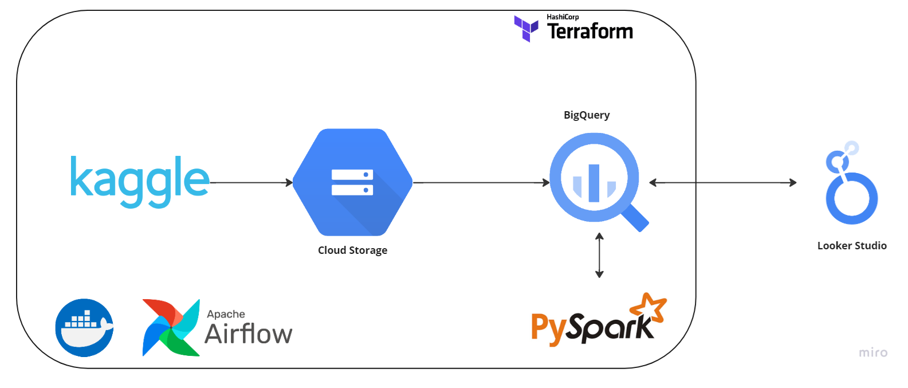
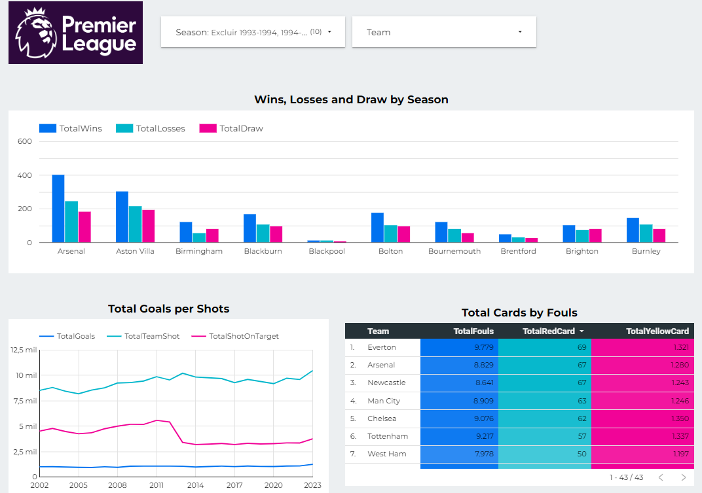

# Premier League Data Pipeline Project

## Problem Description
The goal of this project is to demonstrate the complete end-to-end data pipeline, applying concepts learned throughout the course from Data Engineering Zoomcamp by DataTalksClub. This includes data ingestion, storage, transformation, and visualization. Specifically, we aim to:

1. Select a dataset of interest and ingest it into a data lake.
2. Set up a pipeline to process this dataset and move it to a data warehouse.
3. Transform the data to prepare it for analysis.
4. Build a dashboard to visualize relevant insights.

## Dataset
The dataset chosen for this project captures all English Premier League (EPL) matches from the 1993-1994 season to the present. EPL, the world's most popular football league, has been widely tracked and provides valuable insights into team performance and betting data. The dataset includes:
- All EPL matches from the 1993-1994 season onward.
- Match statistics, when available.
- Betting odds from Bet356, including expected goals per match.

https://www.kaggle.com/datasets/ajaxianazarenka/premier-league/

## Technologies Used
In this project, I chose to utilize the following tools:

- **Infrastructure as Code (IaC)**: Terraform
- **Workflow Orchestration**: Airflow
- **Containerization**: Docker
- **Data Lake**: Google Cloud Storage (GCS)
- **Data Warehouse**: BigQuery
- **Data Transformation**: PySpark
- **Visualization**: Looker Studio

## Project Reproduction
To reproduce this project, follow the instructions below:

1. Prepare Google Cloud Platform (GCP) service accounts with the necessary permissions for GCS and BigQuery.
2. Create GCP infrastructure with Terraform. Change default variables project, region, BQ_DATASET and credentials in variables.tf 
3. Update environment variables for Google Cloud authentication, project ID, and the GCS buckets names in `docker-compose.yaml`.
4. Build the Docker image in `/airflow/` and launch Airflow with `docker-compose up`.
5. Forward port 8080 and connect to it on your local machine.
6. Development of a visualization using LookerStudio

## Summary of Data Pipeline
This project includes an Airflow DAG orchestrating each phase of the data pipeline, from ingestion to storage and transformation:

1. Download of csv file containing the data from KaggleHub;
2. Prepare and convert data from csv to parquet;
3. Upload of data to bucket in google cloud storage (data lake);
4. Load raw data to Bigquery - table pl_external_table;
5. Load transformed data to Bigquery - table team_wise_season_stats;

## Dashboard

The project includes a Looker Studio dashboard displaying key metrics from the EPL dataset.

1. **Match Outcome Overview**: Displays the aggregate statistics for wins, losses, and draws for each team across different seasons
2. **Goals and Shooting Analysis**: Illustrates total goals in relation to team shots and shots on target, offering insights into offensive effectiveness and shooting accuracy.
3. **Fouls and Card Statistics**: Provides a breakdown of total fouls committed along with the counts of red and yellow cards for each team, highlighting disciplinary trends throughout the seasons.

Additionally, users have the flexibility to filter data by selecting one or more seasons and teams, enabling a tailored analysis of team performance and match outcomes in the EPL.

Take a look into the finished dashboard: [here](https://lookerstudio.google.com/s/jFNR3e6WZko)

